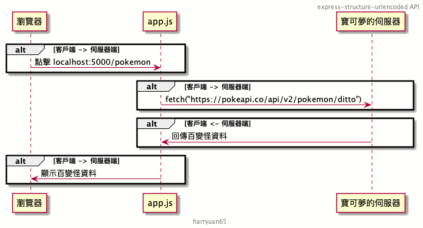

# Express Tutorial: 基本架構、為何要用 urlencoded

## Setup

```bash
yarn install
nodemon app.js
```

## Usage

### 基本架構

其實 express 最精簡只要這樣就可以啟動：
1. 引入 express 工具套件
2. 生成一個可用的 express應用程式
3. 設定監聽一個請求路徑是 '/' 的網址
4. 啟動並開始監聽請求

```javascript
const express = require('express');

const app = express();

app.get('/', function(req, res){
  res.send('Hello!')
});

app.listen(5000, function(){
  console.log(`Listening on ${PORT}`)
});
```

### API 串接

API 指的是應用程式介面，就是說兩個不同的程式想要交換資料的窗口。
在網頁開發的世界中，我們幾乎都是使用 HTTP 這個管道去實作各種 API，讓「前端」、「後端」可以交換資料。

當你使用 `node app.js` 啟動 Server 時，若我們去瀏覽器輸入網址 `localhost:5000`，我們的瀏覽器便作為一個「客戶端」去發送了請求到我們的 app.js「伺服端」。

`fetch` 這個套件是一種客戶端套件，讓我們可以去對遠端伺服器發送/請求資料，一般很常看到前端開發(React/Angular/JQuery/...)會使用，來跟伺服器要資料。

若我們今天在 app.js 這個伺服器內使用 fetch，該如何理解呢？

```javascript
app.get('/pokemon', function(req, res){
  fetch('https://pokeapi.co/api/v2/pokemon/ditto'). //json
  then(resp => {
    console.log(JSON.stringify(resp, null, 2))
    return resp.json();
  }).
  then(data => {
    // console.log(data);
    res.send(data);
  });
})

```

但其實只要是「要資料的一方」都是「客戶端」，所以今天就算我們的 `app.js` 是一個 `express` 的伺服器，當他需要使用 fetch 去其他伺服器請求資料時，都是以一個「客戶端」的身份去取資料。
取回來以後，再以伺服器的角度回傳資料給他的客戶端，也就是我們的瀏覽器。



### urlencoded????

> 每次看人家 express 範例都有 `app.use(express.urlencoded({extended: true})` 是殺小？

用這個專案實驗一下這些步驟：

1. 啟動 `nodemon app.js`
2. 到 `localhost:5000/login` 取得登入頁面
3. 填完資料送出
4. 會發現這46, 47兩行會壞掉

    ```javascript
      var email = req.body.email; //email is not a function for undefined 
      var password = req.body.password;
    ```

4. 可以先把41行註解拿掉，重新填一次表，找 log 中的 headers 那邊
5. 找到 `Content-Type`, `application/x-www-form-urlencoded` 這行
6. 把第 7 行註解拿掉，會發現正常運作了

因為表單送出時，預設是送出 `application/x-www-form-urlencoded` 這個型態的資料給伺服器。
但是 express 很笨，預設他並沒有辦法看懂什麼這種型態的資料。
所以必須要使用一個叫做 `express.urlencoded({extended: true})` 的工具(這個東西是一種 中介軟體，middleware)，他會在所有的請求進來時，先幫我們解析請求的資料，並且放到 `req.body` 裡面，之後我們才可以取得 `req.body.email` 的內容。

